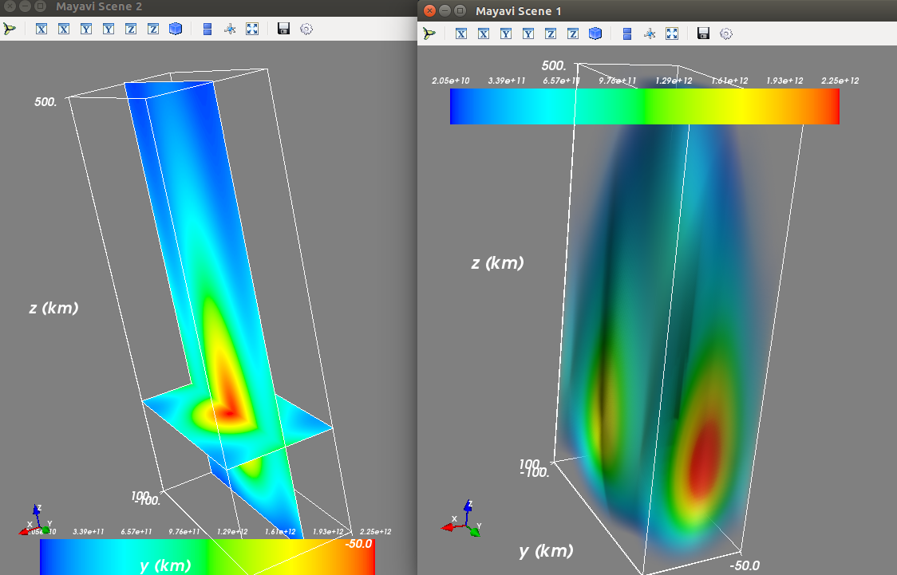

# mayavi-example-python
3-D and 4-D plotting with Mayavi in Python

Requires Python 2.x due to Mayavi and TVTK

Notes:
------
If running in Linux using Anaconda, and you get an error like:

TraitError: Cannot set the undefined 'number_of_table_values' attribute of a 'LookupTable' object.

try using system Python 

/usr/bin/python2

and install mayavi by
``` 
sudo apt-get install mayavi2 
```
